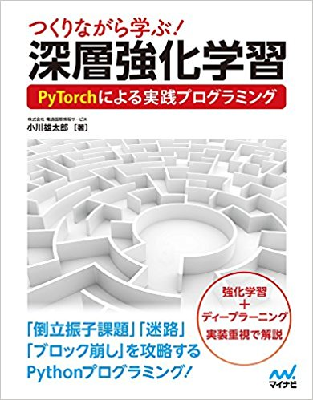
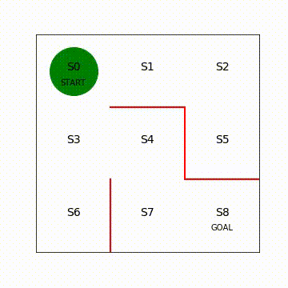
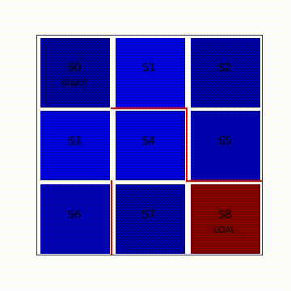

# Deep-Reinforcement-Learning-Book
[書籍「つくりながら学ぶ！深層強化学習」、著者：株式会社電通国際情報サービス 小川雄太郎、出版社: マイナビ出版 (2018/6/28) ](https://www.amazon.co.jp/%E3%81%A4%E3%81%8F%E3%82%8A%E3%81%AA%E3%81%8C%E3%82%89%E5%AD%A6%E3%81%B6-%E6%B7%B1%E5%B1%A4%E5%BC%B7%E5%8C%96%E5%AD%A6%E7%BF%92-PyTorch%E3%81%AB%E3%82%88%E3%82%8B%E5%AE%9F%E8%B7%B5%E3%83%97%E3%83%AD%E3%82%B0%E3%83%A9%E3%83%9F%E3%83%B3%E3%82%B0-%E6%A0%AA%E5%BC%8F%E4%BC%9A%E7%A4%BE%E9%9B%BB%E9%80%9A%E5%9B%BD%E9%9A%9B%E6%83%85%E5%A0%B1%E3%82%B5%E3%83%BC%E3%83%93%E3%82%B9-%E5%B0%8F%E5%B7%9D%E9%9B%84%E5%A4%AA%E9%83%8E/dp/4839965625)のサポートリポジトリです。


最下部にFAQを追記しました（2019年3月24日最新）

最下部に正誤表を記載しております（2019年1月31日最新）。





図　ブロック崩しを攻略（A2Cを使用し、GPU1枚で3時間の学習後）


図　迷路をランダムに移動


図　迷路を強化学習


図　迷路内の各位置の価値を学習


図　倒立振子を制御


----

### 正誤表

#### [1] 初版：p. 46

パラメータθの更新量の式において、符号がマイナスであるべき部分がプラスになっていました。これに伴い以下3点の修正をお願いします。

```
[1-1] p. 46 式（2行目）
⊿θ_{s, a_j} = {N(s_i, a_j) + P(s_i, a_j) N(s_i, a)} / T
↓
⊿θ_{s, a_j} = {N(s_i, a_j) - P(s_i, a_j) N(s_i, a)} / T


[1-2] p. 47 コード（上段）
delta_theta[i, j] = (N_ij + pi[i, j] * N_i) / T
↓
delta_theta[i, j] = (N_ij - pi[i, j] * N_i) / T


[1-3] p. 48 コード
stop_epsilon = 10**-8
↓
stop_epsilon = 10**-4
```

#### [2] 4.3「PyTorchで手書き数字画像の分類課題MNISTを実装」
p.109、「mnist = fetch_mldata('MNIST original')　が実行できない問題」への対処法。
該当ファイル：4_3_PyTorch_MNIST.ipynbを修正しました。


#### [3] 2.3「方策反復法の実装」
p.46、●方策反復法に従い方策を更新する、の2つの数式内の変数の添え字を訂正いたします。
```
⊿θ_{s, a_j}
↓
⊿θ_{s_i, a_j}
```

----

### FAQ

#### 7.4 A2C実装（前半）のクラスNet実装内の、value, actor_output = self(x)の動作について
7.4 A2Cの実装（前半）のClass Netの実装（初版ではp.217-219）において、

def act(self, x):、def get_value(self, x):、def evaluate_actions(self, x, action):

などの関数定義内で

value, actor_output = self(x)

というコードがあります。この部分のself(x)の解説補足です。

このself(x)は同じクラスNetのforward関数を実行しています。

def forward(self, x):のreturn を見ると

return critic_output, actor_output

となっていますが、これらが、self(x)のreturn値である、valueとactor_outputに対応しています。

なぜself(x)でforward()が実行されるのか補足します。

まずself()は自分自身を意味しますので、self(x)とはNet(x)を示します。

そしてクラスNetはnn.Moduleクラスを継承しています。

nn.Moduleクラスは__call__()というメソッドを持っており、その中で、forward()が実行されるように指定されています。

この__call__()というメソッドは、Pythonの一般的なメソッドです。

そのクラスのオブジェクトが具体的な関数を指定されずに呼び出されたときに動作する関数です。

よって、Net(x)の具体的なオブジェクトがあったとします。

例えば、

net = Net(n_in=4, n_mid=32, n_out=2)

でnetというクラスNetのオブジェクトができます。

ここで

net(x)

と、具体的な関数を指定せずに実行すると

netの__call__(x)が実行され、

この__call__()のなかにある、

net.forward(x)

が実行されることになります。

つまり、self(x) → Net(x) → Netの__call__(x) → Net.forward(x)


という関係になっています。

そのためself(x)によってforward(x)が実行されています。


